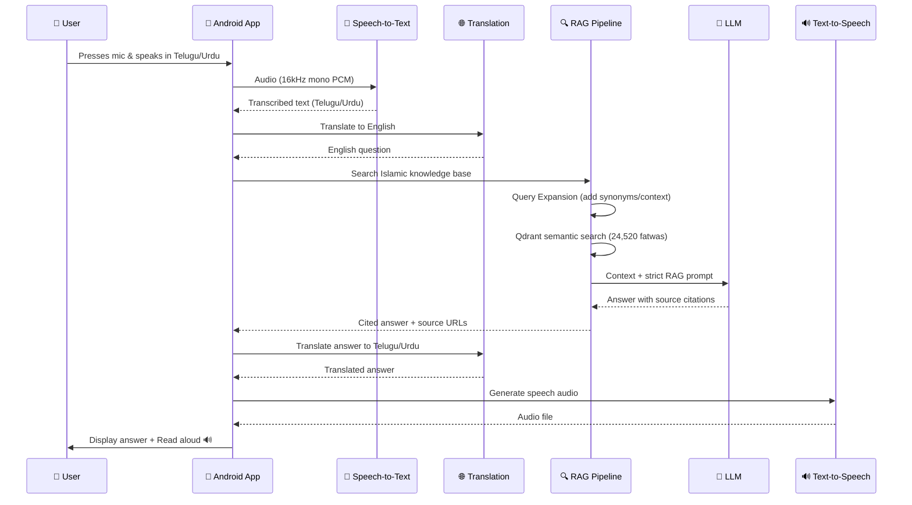

<](https://www.gnu.org/licenses/gpl-3.0)
[](https://developer.android.com)
[](https://kotlinlang.org)
[](https://www.python.org)
[](https://docs.docker.com/compose/)
[](#-privacy-first-design)
[](#-technology-stack)

---

*No typing required. No English required. Fully voice-based.*

*Ask Islamic questions in Telugu, Urdu, or Hindi — get cited answers read back to you.*

</div>

---

## 📋 Table of Contents

- [The Problem](#-the-problem)
- [Our Solution](#-our-solution)
- [How It Works](#-how-it-works)
- [Key Features](#-key-features)
- [System Architecture](#-system-architecture)
- [Three-Tier Offline Strategy](#-three-tier-offline-strategy)
- [Technology Stack](#-technology-stack)
- [Current Development Status](#-current-development-status)
- [Getting Started](#-getting-started)
- [Project Structure](#-project-structure)
- [Islamic Content Integrity](#-islamic-content-integrity)
- [Privacy-First Design](#-privacy-first-design)
- [Known Issues & Limitations](#-known-issues--limitations)
- [Roadmap](#-roadmap)
- [Contributing](#-contributing)
- [Developer Notes](#-developer-notes)
- [License](#-license)
- [Acknowledgements](#-acknowledgements)

---

## 🎯 The Problem

Millions of Muslims in rural India — particularly in **Kurnool (Andhra Pradesh), Telangana, and surrounding regions** — face significant barriers to accessing authentic Islamic knowledge:

| Barrier | Impact |
|---------|--------|
| **Language** | Most authentic Islamic Q&A resources (like IslamQA.info) are in English or Arabic — not in Telugu or Urdu |
| **Literacy** | Many community members cannot read or write in any language — they communicate entirely through speech |
| **Digital Literacy** | Even those with smartphones struggle to type queries, navigate web browsers, or evaluate search results |
| **Misinformation** | Without access to authenticated sources, people rely on word-of-mouth, which can spread incorrect rulings |
| **Internet Access** | Reliable internet is not always available, making cloud-dependent apps unusable |

**The result:** A large population of sincere Muslims who *want* to learn about their religion but are **locked out** by technology, language, and literacy barriers.

---

## 💡 Our Solution

**Rushd-ul-Ilm** (رشد العلم — *Growth of Knowledge*) is a **voice-first Android app** that removes every barrier:

```
🎤 Press the big microphone button
🗣️ Ask your question in Telugu, Urdu, or Hindi
🔍 AI searches authenticated Islamic scholar databases
📖 Get a cited answer with source URLs
🔊 The app reads the answer aloud in your language
```

### What makes this different?

| Feature | Rushd-ul-Ilm | Typical Islamic Apps |
|---------|-------------|---------------------|
| Voice Input | ✅ Primary interface — no typing needed | ❌ Typing required |
| Local Languages | ✅ Telugu, Urdu, Hindi, English | ❌ Usually English/Arabic only |
| Source Citations | ✅ Every answer links to the original fatwa URL | ❌ Often uncited |
| Read Aloud | ✅ Built-in TTS in local languages | ❌ Rare |
| Offline Mode | ✅ Three-tier fallback (Internet → LAN → Fully Offline) | ❌ Internet-dependent |
| Privacy | ✅ Zero telemetry, all AI runs locally | ❌ Cloud APIs, analytics |
| Open Source | ✅ GPLv3 — community-driven | ❌ Proprietary |

---

## 🔄 How It Works



---

## ✨ Key Features

### 🎤 Voice-First Interface
- **Giant microphone button** (40%+ of screen height) — designed for illiterate users
- Press once to ask, tap "Read Aloud" to hear the answer
- Minimum 48dp touch targets for all interactive elements
- Minimum 16sp font size for all text

### 🌍 Multilingual Support
- **Telugu** (తెలుగు), **Urdu** (اردو), **Hindi** (हिंदी), **English**
- Dynamic language switching in Settings
- Bilingual labels throughout (local language + English)
- Powered by **IndicTrans2** (state-of-the-art Indic translation model)

### 📚 Authenticated Islamic Knowledge
- **15,739 fatwas** from [IslamQA.info](https://islamqa.info/en) (neutral, no madhab bias)
- **8,781 fatwas** from [Darul Ifta Deoband](https://darulifta-deoband.com/en) (Hanafi madhab)
- **Every answer** includes clickable source URLs — never unattributed
- Madhab preference filtering (Hanafi / Neutral / All sources)
- AI strictly instructed: *"Answer ONLY from provided context. Never use your own knowledge."*

### 🧠 Smart AI Features
- **Query Expansion**: AI enhances vague questions with Islamic terminology before searching
- **Conversational Clarification**: For broad topics like "Prayer", the AI asks follow-up questions
- **Multi-turn Chat**: Follow-up questions maintain context from previous answers
- **AI Transparency**: Users can see the expanded search query the AI used

### 📵 Works Offline
- **Three-tier architecture**: Internet → LAN → Fully Offline
- On-device speech-to-text via **whisper.cpp** (182MB model, runs on phone CPU)
- On-device translation via **Opus-MT ONNX** (planned)
- Offline keyword search via **Room FTS5** database
- Android built-in **TextToSpeech** for offline read-aloud

### 💾 Answer History
- All answers automatically saved to local Room database
- Browse past answers anytime — even offline
- Dedicated "Answers" tab in bottom navigation

### 🔒 Complete Privacy
- **Zero telemetry** — no analytics, no crash reporters
- **No cloud APIs** — all AI inference on local GPU or user's phone
- Voice recordings never leave the device/server
- No Firebase, no Google Analytics, no third-party SDKs

---

## 🏗️ System Architecture

```
┌──────────────────────────────────────────────────────────────────┐
│  Layer 1: Android App (Kotlin + Jetpack Compose)                 │
│  5 screens: Home (mic) → Answer → Answers History → Videos →     │
│  Settings                                                        │
└──────────────────────────┬───────────────────────────────────────┘
                           │ HTTP calls via Retrofit + OkHttp
                           ▼
┌──────────────────────────────────────────────────────────────────┐
│  Layer 2: AI/NLP Core (Ubuntu Server — Docker Compose)           │
│  faster-whisper (STT) → IndicTrans2 (translate) → Parler (TTS)  │
└──────────────────────────┬───────────────────────────────────────┘
                           │
                           ▼
┌──────────────────────────────────────────────────────────────────┐
│  Layer 3: Islamic Knowledge Sources                              │
│  islamqa.info + Darul Ifta Deoband → SQLite → Qdrant vectors    │
└──────────────────────────┬───────────────────────────────────────┘
                           │
                           ▼
┌──────────────────────────────────────────────────────────────────┐
│  Layer 4: RAG Pipeline (LlamaIndex + Qdrant + LLM)              │
│  Semantic search → Context assembly → LLM generation            │
│  "Answer ONLY from provided context. Cite source URL."          │
└──────────────────────────┬───────────────────────────────────────┘
                           │
                           ▼
┌──────────────────────────────────────────────────────────────────┐
│  Layer 5: Islamic Video Database (Planned)                       │
│  YouTube lectures + whisper transcripts → searchable offline     │
└──────────────────────────┬───────────────────────────────────────┘
                           │
                           ▼
┌──────────────────────────────────────────────────────────────────┐
│  Layer 6: Self-Hosted Backend (Docker Compose)                   │
│  FastAPI (8000) + Ollama (11434) + Qdrant (6333) +              │
│  IndicTrans2 (8001) + TTS (8002) + STT (8003)                  │
└──────────────────────────────────────────────────────────────────┘
```

> 📐 For detailed architecture diagrams including data flow, MVVM patterns, and backend service interactions, see [docs/ARCHITECTURE.md](docs/ARCHITECTURE.md).

---

## 📵 Three-Tier Offline Strategy

Every feature that touches the internet implements **all three tiers** automatically:

| Capability | Tier 1: Internet | Tier 2: LAN | Tier 3: Fully Offline |
|-----------|-----------------|-------------|----------------------|
| **Speech-to-Text** | faster-whisper GPU (~1s) | Same via LAN IP | whisper.cpp JNI on-device (~8s) |
| **Translation** | IndicTrans2 GPU (best accuracy) | Same via LAN IP | Opus-MT ONNX on-device (planned) |
| **Text-to-Speech** | Indic Parler TTS (natural voice) | Same via LAN IP | Android TTS API + Google voice packs |
| **Q&A Search** | Qdrant semantic + LLM (full RAG) | Same via LAN IP | Room FTS5 keyword search on local DB |
| **Video Playback** | Stream from server | Stream via LAN | ExoPlayer from local storage |

The app detects the network tier in real-time using `ConnectivityManager.NetworkCallback` and switches automatically.

---

## ⚙️ Technology Stack

### Android App (User's Phone)

| Component | Technology | Purpose |
|-----------|-----------|---------|
| Language | Kotlin 2.x | Android's official modern language |
| UI Framework | Jetpack Compose | Declarative UI — no XML layouts |
| Architecture | MVVM + StateFlow + Hilt DI | Clean separation of concerns |
| Local DB | Room (SQLite) + FTS5 | Offline search & answer history |
| HTTP Client | Retrofit + OkHttp | Backend API communication |
| Video Player | ExoPlayer / Media3 | Offline + streaming video |
| Audio Capture | AudioRecord API | 16kHz mono PCM for STT |
| Offline STT | whisper.cpp via JNI (NDK) | On-device speech recognition |
| Offline TTS | Android TextToSpeech | Built-in speech synthesis |

### Backend Server (Ubuntu + GPU)

| Service | Port | GPU | Purpose |
|---------|------|-----|---------|
| FastAPI | 8000 | Optional | Main API gateway — `/query`, `/transcribe`, `/translate`, `/tts` |
| Ollama | 11434 | YES (CUDA) | Serves Qwen3:4b LLM locally (fallback) |
| Qdrant | 6333 | No | Vector database for semantic search |
| IndicTrans2 | 8001 | YES (CUDA) | Telugu/Urdu/Hindi ↔ English translation |
| Indic Parler TTS | 8002 | YES (CUDA) | Text-to-speech in Indian languages |
| faster-whisper | 8003 | YES (CUDA) | GPU speech-to-text |

### AI Models

| Model | Purpose | Size | VRAM |
|-------|---------|------|------|
| meta/llama-3.3-70b-instruct | Primary LLM (via NVIDIA NIM API) | Cloud | 0 GB |
| Qwen3:4b Q4_K_M | Fallback local LLM (via Ollama) | 2.5 GB | ~2.5 GB |
| paraphrase-multilingual-MiniLM-L12-v2 | Text embeddings for Qdrant | ~420 MB | CPU |
| IndicTrans2 (8-bit quantized) | Translation | ~2 GB | ~1.5 GB |
| ai4bharat/indic-parler-tts | Text-to-speech | ~1.5 GB | ~1.8 GB |
| faster-whisper-large-v3-turbo | Speech-to-text | ~1.5 GB | ~1.5 GB |
| ggml-small-q5_1 (whisper.cpp) | Offline on-device STT | 182 MB | CPU only |

> ⚠️ **Hardware Limit**: All GPU models are designed for the **RTX 3050 (4GB VRAM)**. Dynamic GPU offloading ensures only one model uses the GPU at a time.

---

## 📊 Current Development Status

| Phase | Name | Status | Description |
|-------|------|--------|-------------|
| Phase 1 | Android UI Skeleton | ✅ Complete | 5 screens with navigation, theming, accessibility |
| Phase 2 | Backend Docker Services | ✅ Complete | FastAPI + Qdrant + Ollama containerized |
| Phase 3 | Knowledge Ingestion | ✅ Complete | 24,520 fatwas embedded in Qdrant |
| Phase 4 | Android ↔ Backend | ✅ Complete | Full Q&A pipeline, answer history, network detection |
| Phase 5 | Multilingual + Offline | 🟡 ~90% | Translation, TTS, STT working; offline translation pending |
| Phase 6 | Video Library + Deployment | ⬜ Not Started | Video indexing, production deployment |

> 📋 For detailed feature status, see [docs/DEVELOPMENT_STATUS.md](docs/DEVELOPMENT_STATUS.md).

---

## 🚀 Getting Started

### Prerequisites

- **Android Studio** Panda 4 (2025.3.4+) with Kotlin 2.x support
- **Python** 3.11+
- **Docker** + Docker Compose
- **NVIDIA GPU** with 4GB+ VRAM and NVIDIA Container Toolkit
- **Linux OS** recommended (developed on Parrot OS)

### 1. Clone the Repository

```bash
git clone https://github.com/IslamicITHub/rushdul-ilm.git
cd rushdul-ilm
```

### 2. Set Up the Android App

```bash
# Open the android-app/ folder in Android Studio
# Set JAVA_HOME to Android Studio's bundled JBR:
export JAVA_HOME=/path/to/android-studio/jbr

# Build the debug APK
cd android-app
./gradlew assembleDebug
```

### 3. Set Up the Backend

```bash
# Install Ollama and pull the fallback LLM model
curl -fsSL https://ollama.com/install.sh | sh
ollama pull qwen3:4b

# Create environment file
cp backend/.env.example backend/.env
# Edit .env to add your NVIDIA_API_KEY and HF_TOKEN

# Start all Docker services
cd backend
docker compose up -d

# Verify services are running
curl http://localhost:8000/health
curl http://localhost:6333/
```

### 4. Ingest Islamic Knowledge

```bash
# Run inside the FastAPI container or with appropriate Python venv
python backend/ingest_islamqa.py    # Embeds IslamQA fatwas into Qdrant
python backend/ingest_deoband.py    # Embeds Deoband fatwas into Qdrant
```

### 5. Test the Q&A Pipeline

```bash
curl -X POST http://localhost:8000/query \
  -H "Content-Type: application/json" \
  -d '{"question": "How to perform wudu?", "language": "en"}'
```

> 📖 For detailed setup instructions, see [docs/SETUP_GUIDE.md](docs/SETUP_GUIDE.md) *(coming soon)*.

---

## 📁 Project Structure

```
rushdul-ilm/
│
├── README.md                           ← You are here
├── LICENSE                             ← GPLv3
├── CONTRIBUTING.md                     ← How to contribute
├── AGENT_RULES.md                      ← AI agent coding rules
├── SPRINT_SYSTEM.md                    ← Micro-task breakdown
│
├── docs/                               ← GitHub documentation
│   ├── ARCHITECTURE.md                 ← System design & diagrams
│   └── DEVELOPMENT_STATUS.md           ← Current build progress
│
├── android-app/                        ← Android Studio project
│   └── app/src/main/java/com/rushdululilm/app/
│       ├── ui/screens/                 ← 5 Jetpack Compose screens
│       │   ├── HomeScreen.kt           ← Main mic button screen
│       │   ├── AnswerScreen.kt         ← Displays cited Islamic answer
│       │   ├── AnswersHistoryScreen.kt ← Past answers from Room DB
│       │   ├── VideoLibraryScreen.kt   ← Video lecture browser
│       │   ├── SettingsScreen.kt       ← Language, madhab, offline
│       │   ├── NavGraph.kt             ← Navigation controller
│       │   └── Routes.kt              ← Route string constants
│       ├── ui/components/              ← Reusable Compose components
│       │   ├── MicButton.kt            ← Animated microphone button
│       │   ├── LanguageSelector.kt     ← Language dropdown
│       │   ├── SourceSelector.kt       ← Islamic source filter chips
│       │   └── VideoCard.kt            ← Video list item card
│       ├── ui/theme/                   ← Material3 theming
│       ├── viewmodel/                  ← MVVM ViewModels
│       ├── model/                      ← Data classes & enums
│       ├── data/local/                 ← Room database (entities, DAOs)
│       ├── data/remote/                ← Retrofit API service
│       ├── data/repository/            ← Repository pattern
│       ├── di/                         ← Hilt dependency injection
│       └── utils/                      ← Network utils, audio helpers
│
├── backend/                            ← Python server code
│   ├── docker-compose.yml              ← All services in one file
│   ├── fastapi_server.py               ← Main API gateway
│   ├── rag_pipeline.py                 ← LlamaIndex RAG engine
│   ├── translation_service.py          ← IndicTrans2 endpoint
│   ├── tts_service.py                  ← Parler TTS endpoint
│   ├── stt_service.py                  ← faster-whisper endpoint
│   ├── ingest_islamqa.py               ← IslamQA → Qdrant embeddings
│   └── ingest_deoband.py               ← Deoband → Qdrant embeddings
│
├── Report Documentation/               ← Internal development docs
│
└── activity-logs/                      ← AI agent session logs
    └── ACTIVITY_LOG.md                 ← Detailed session history
```

---

## 🕌 Islamic Content Integrity

This project treats Islamic knowledge with the **highest level of responsibility**:

### Source Verification
Every answer displayed in the app comes from **authenticated Islamic scholar websites only**:

| # | Source | URL | Madhab | Fatwas |
|---|--------|-----|--------|--------|
| 1 | IslamQA.info | https://islamqa.info/en | Neutral (no madhab bias) | 15,739 |
| 2 | IslamQA.org | https://islamqa.org | Neutral | Planned |
| 3 | Darul Ifta Deoband | https://darulifta-deoband.com/en | Hanafi | 8,781 |

### Strict RAG-Only Policy
```
❌ The AI is NEVER allowed to generate Islamic rulings from its own training data
✅ The AI can ONLY answer from verified source documents in the vector database
✅ Every answer MUST include the original source URL as a clickable link
✅ If no relevant answer is found, the app says:
   "I could not find an answer in the approved Islamic sources.
    Please consult a qualified Islamic scholar."
```

### Adding New Sources
New Islamic sources can **only** be added with **explicit approval** from the project maintainer. This prevents unauthorized or inauthentic content from entering the knowledge base.

---

## 🔒 Privacy-First Design

```
What NEVER happens in this app:
  ❌ No Google Analytics or Firebase
  ❌ No crash reporters that send data externally
  ❌ No cloud LLM API calls (OpenAI, Anthropic, Google Gemini)
  ❌ No voice recordings sent to any cloud service
  ❌ No user query tracking or profiling
  ❌ No third-party SDKs that collect data

What ALWAYS stays local:
  ✅ Voice recordings — processed on Ubuntu server or on-device
  ✅ Islamic questions — never sent to Google, OpenAI, or any cloud
  ✅ User history — only in local Room database on the phone
  ✅ LLM inference — Qwen3:4b via Ollama or NVIDIA NIM API
  ✅ Translation — IndicTrans2 self-hosted / Opus-MT on phone
  ✅ All infrastructure — fully self-hosted Docker services
```

---

## ⚠️ Known Issues & Limitations

| Issue | Status | Workaround |
|-------|--------|------------|
| 4GB VRAM limit prevents running multiple GPU models simultaneously | ✅ Resolved | Dynamic GPU offloading — models load to GPU only during inference |
| Hindi translation can produce text repetition loops | ✅ Resolved | Pinned `transformers==4.45.2` for translation service |
| UserPreferencesRepository uses in-memory storage | 🟡 Open | Needs migration to `DataStore` for persistence across restarts |
| whisper.cpp model weights (182MB) not in repo | 🟡 By Design | Must be downloaded separately before building release APK |
| Android emulator ADB drops connection sometimes | 🟡 Open | Reconnect via `adb connect` |
| Docker containers use ~2-3GB RAM combined | 🟡 Open | Lazy loading lifespan pattern implemented to reduce idle memory |
| Offline translation (Opus-MT ONNX) not yet implemented | 🟡 Planned | Phase 6 deliverable |

---

## 🗺️ Roadmap

### Phase 6 — Video Library + Deployment (Upcoming)
- [ ] Index Islamic YouTube lectures with whisper transcripts
- [ ] Searchable video database in Qdrant
- [ ] Offline video download & ExoPlayer playback
- [ ] Production backend deployment to Linux VPS
- [ ] Google Play Store listing

### Future Plans
- [ ] iOS version (after Android is complete)
- [ ] Opus-MT ONNX for fully offline on-device translation
- [ ] Community-submitted Islamic sources (with moderation)
- [ ] Multiple regional language support (Kannada, Tamil, Malayalam)
- [ ] Mosque/community center deployment kits
- [ ] Arabic language support
- [ ] Bookmark & share answers
- [ ] Family sharing mode (multiple users on one device)

---

## 🤝 Contributing

We welcome contributions from developers, Islamic scholars, translators, and community members!

Please read [CONTRIBUTING.md](CONTRIBUTING.md) for:
- Development setup instructions
- Coding standards (line-by-line commenting required!)
- Islamic content rules
- Privacy requirements
- Pull request workflow

### Quick Start for Contributors
1. Fork the repository
2. Create a feature branch (`git checkout -b feature/your-feature`)
3. Follow the coding standards in `AGENT_RULES.md`
4. Ensure every line of code has a beginner-friendly comment
5. Submit a Pull Request with a clear description

### Areas Where Help is Needed
- 🌍 **Translators**: Help translate the app UI into more Indian languages
- 🕌 **Islamic Scholars**: Review and validate fatwa source accuracy
- 📱 **Android Developers**: Help with UI/UX improvements and accessibility
- 🐍 **Python Developers**: Help optimize the RAG pipeline and backend services
- 📝 **Documentation**: Help improve user guides and API documentation
- 🧪 **Testers**: Test on various Android devices and report issues

---

## 👨‍💻 Developer Notes

### For AI Agents Working on This Project
- Read `AGENT_RULES.md` **first** — it contains all project rules
- Read `SPRINT_SYSTEM.md` for the micro-task breakdown
- Read `activity-logs/ACTIVITY_LOG.md` for session history
- Every line of code **must** have a beginner-friendly comment
- The developer (Shaik Hidayatullah) is learning Android development — explain concepts!

### Build Configuration
```bash
# Android build requires Android Studio's bundled JDK
export JAVA_HOME=/path/to/android-studio/jbr

# Build the app
cd android-app && ./gradlew assembleDebug

# Backend services
cd backend && docker compose up -d
```

### Important Constants
- Android package name: `com.rushdululilm.app` (NEVER change)
- Minimum Android SDK: API 31 (Android 12)
- Target SDK: API 34 (Android 14)

### Backend Environment Variables
```env
NVIDIA_API_KEY=your_nvidia_nim_api_key    # For primary LLM
HF_TOKEN=your_huggingface_token           # For gated model downloads
```

---

## 📜 License

This project is licensed under the **GNU General Public License v3.0** — see the [LICENSE](LICENSE) file for details.

You are free to use, modify, and distribute this software, but any derivative work must also be open source under the same license.

---

## 🙏 Acknowledgements

### Islamic Knowledge Sources
- [IslamQA.info](https://islamqa.info/en) — For their comprehensive fatwa database
- [Darul Ifta Deoband](https://darulifta-deoband.com/en) — For their Hanafi madhab fatwa database

### AI & Technology
- [Ollama](https://ollama.com) — Local LLM serving
- [Qdrant](https://qdrant.tech) — Vector database
- [LlamaIndex](https://www.llamaindex.ai/) — RAG framework
- [IndicTrans2](https://github.com/AI4Bharat/IndicTrans2) (AI4Bharat) — Indian language translation
- [Parler TTS](https://github.com/huggingface/parler-tts) / [AI4Bharat](https://github.com/AI4Bharat) — Indian language text-to-speech
- [whisper.cpp](https://github.com/ggerganov/whisper.cpp) — On-device speech recognition
- [faster-whisper](https://github.com/SYSTRAN/faster-whisper) — GPU speech recognition
- [NVIDIA NIM](https://build.nvidia.com/) — Cloud LLM inference API

### Developer
- **Shaik Hidayatullah** — Project creator & maintainer, Kurnool, Andhra Pradesh, India

---

<div align="center">

**بِسْمِ اللَّهِ الرَّحْمَنِ الرَّحِيم**

*In the name of Allah, the Most Gracious, the Most Merciful*

*Built with ❤️ for the Muslim community of Kurnool and beyond*

**[⭐ Star this repo](https://github.com/IslamicITHub/rushdul-ilm) if you find this project beneficial!**

</div>
]]>
