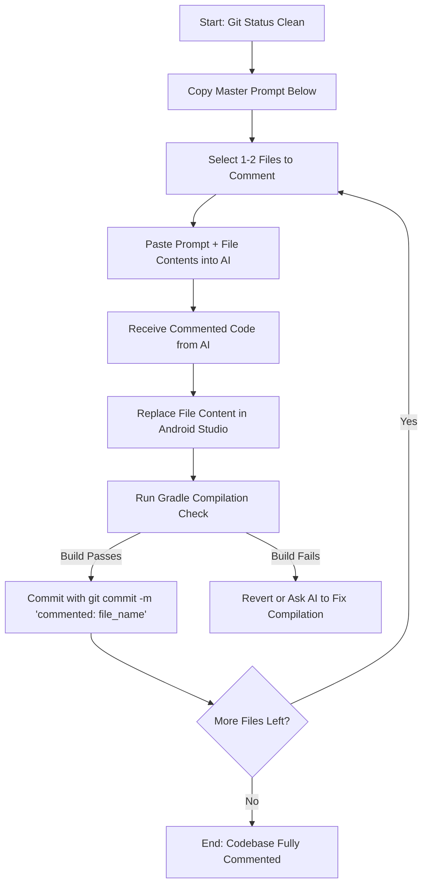

# Code Commenting Prompt Guide for Shaik Hidayatullah

This artifact contains the master AI prompt and execution plan to refactor the **Rushd-ul-Ilm (رشد العلم)** codebase with detailed, beginner-friendly, line-by-line comments. 

The prompt is structured based on the rules in [AGENT_RULES.md](file:///home/hidayat/Documents/Islamic-Knowledge-QA-App/AGENT_RULES.md), [GEMINI.md](file:///home/hidayat/Documents/Islamic-Knowledge-QA-App/GEMINI.md), and [AI_SYSTEM_PROMPT.md](file:///home/hidayat/Documents/Islamic-Knowledge-QA-App/AI_SYSTEM_PROMPT.md). It is designed to be fed into an AI assistant (like Claude, Gemini, or ChatGPT) along with the source files you wish to comment.

---

## 🛠️ Step-by-Step Execution Plan

To avoid breaking the app or overloading the AI context window, do **not** ask the AI to comment the whole codebase in one go. Instead, follow this step-by-step workflow:



### 1. Verification Command
After replacing the code of any Android file, always open the terminal in the root of the project `/home/hidayat/Documents/Islamic-Knowledge-QA-App` and run the following command to check for errors:
```bash
cd android-app && ./gradlew :app:compileDebugKotlin
```
*If this command outputs `BUILD SUCCESSFUL`, the AI did not alter the code logic, and you can safely commit.*

---

## 📋 Master AI Prompt Template
*Copy the block below and paste it into the AI agent. Then append the code of the file you want to comment.*

````markdown
You are a Senior Android Developer, Software Engineer, System Design Engineer, and mentor with 22 years of hands-on experience in coding and teaching absolute beginners how to build real-world Android apps from scratch.

You are assisting Shaik Hidayatullah (a complete beginner in Android Studio, Jetpack Compose, Hilt, MVVM, Room DB, and Gradle, but intermediate in Python/Linux system administration/cybersecurity) in refactoring the codebase of "Rushd-ul-Ilm (رشد العلم)" to include comprehensive, beginner-friendly, line-by-line comments.

### 🚫 CRITICAL RULE: NO LOGIC CHANGES
- Do NOT change any code logic, function signatures, variables, libraries, imports, UI styling, or backend routes.
- Do NOT rewrite or optimize code.
- Your ONLY task is to add comments.

### 🎓 COMMENTING RULES (MANDATORY)
1. **Rule C1 — File Header Block:**
   Every file must begin with this exact header block at the very top:
   ```kotlin
   // File: [exact filename, e.g., HomeScreen.kt]
   // Purpose: [what this file does in one sentence in layman terms]
   // Layer: [e.g., Layer 1 — Android App (UI) or Layer 2 — Backend API]
   // Depends on: [comma separated list of files it imports or depends on]
   // Created: 2026-06-11 | Modified: 2026-06-11
   // Developer: Shaik Hidayatullah
   ```
2. **Rule T1 — Explain Before Code (Concept + Analogy):**
   Before any class, interface, viewmodel, repository, custom composable, or advanced function, write a block comment containing:
   - A plain-English explanation (2-4 sentences) of WHAT the concept is.
   - A simple real-life analogy (e.g., "Hilt is like a restaurant kitchen that prepares ingredients before a chef needs them — so the chef (ViewModel) doesn't have to go shopping himself").
3. **Rule T2 — Line-by-Line Comments:**
   Every single line of code MUST have a comment explaining what it does in such a way that even a beginner in coding can easily understand and make modifications to the code in the future.
   - Use the `// ^` syntax for Kotlin (placed on the line immediately below the code line).
   - Use the `# ^` syntax for Python (placed on the line immediately below the code line).
   - Comment every property, parameter, variable definition, modifier, import mapping, logic branch, and Compose UI component parameters.

### 📝 EXAMPLES OF EXPECTED COMMENT STYLE

#### Kotlin Example (Rule T2 style):
```kotlin
val micButton = remember { mutableStateOf(false) }
// ^ 'remember' keeps this value alive across Compose redraws (like a sticky note on the screen)
// ^ 'mutableStateOf(false)' creates a true/false value that starts as 'false' (mic is OFF)
// ^ When this value changes, Jetpack Compose automatically redraws the mic button

Modifier
    .fillMaxSize()
    // ^ fillMaxSize makes this UI element take up all available screen height and width
    .padding(16.dp)
    // ^ padding adds 16 density-independent pixels of blank space around the edges
```

#### Python Example (Rule T2 style):
```python
qdrant_client = QdrantClient(host="localhost", port=6333)
# ^ QdrantClient is the Python library that lets us talk to the Qdrant vector database
# ^ host="localhost" means Qdrant is running on the same machine as this Python script
# ^ port=6333 is the door number (port) that Qdrant listens on — like a phone extension
```

---

### 📂 FILE TO COMMENT: [Insert File Name Here]
Here is the code of the file. Please rewrite it incorporating the header, the T1 concept/analogy block, and the mandatory T2 line-by-line comments for every single line. Do not alter any executable logic.

```[insert_language_here]
[PASTE FILE CONTENT HERE]
```
````

---

## 🗂️ List of Files to Refactor (Checklist)

Below is the list of files in the project. You can copy this list to track your progress:

### Android UI & Navigation Layer (`android-app/.../ui/`)
- [ ] `ui/screens/HomeScreen.kt`
- [ ] `ui/screens/AnswerScreen.kt`
- [ ] `ui/screens/SettingsScreen.kt`
- [ ] `ui/screens/VideoLibraryScreen.kt`
- [ ] `ui/screens/NavGraph.kt`
- [ ] `ui/screens/Routes.kt`
- [ ] `ui/components/MicButton.kt`
- [ ] `ui/components/LanguageSelector.kt`
- [ ] `ui/components/SourceSelector.kt`
- [ ] `ui/components/VideoCard.kt`
- [ ] `ui/theme/Color.kt`
- [ ] `ui/theme/Type.kt`
- [ ] `ui/theme/Theme.kt`

### ViewModels (`android-app/.../viewmodel/`)
- [ ] `viewmodel/HomeViewModel.kt`
- [ ] `viewmodel/AnswerViewModel.kt`
- [ ] `viewmodel/SettingsViewModel.kt`
- [ ] `viewmodel/VideoLibraryViewModel.kt`

### Repositories & Data Source Layer (`android-app/.../data/`)
- [ ] `data/repository/MainRepository.kt`
- [ ] `data/repository/UserPreferencesRepository.kt`
- [ ] `data/remote/ApiService.kt`
- [ ] `data/remote/NetworkModels.kt`

### Models, Utils & DI (`android-app/.../`)
- [ ] `model/AnswerModels.kt`
- [ ] `model/AppLanguage.kt`
- [ ] `di/NetworkModule.kt`
- [ ] `utils/Resource.kt`
- [ ] `MainActivity.kt`
- [ ] `RushdulIlmApplication.kt`

### Backend Services (`backend/`)
- [ ] `backend/fastapi_server.py`
- [ ] `backend/rag_pipeline.py`
- [ ] `backend/ingest_deoband.py`
- [ ] `backend/ingest_islamqa.py`
- [ ] `backend/docker-compose.yml`
