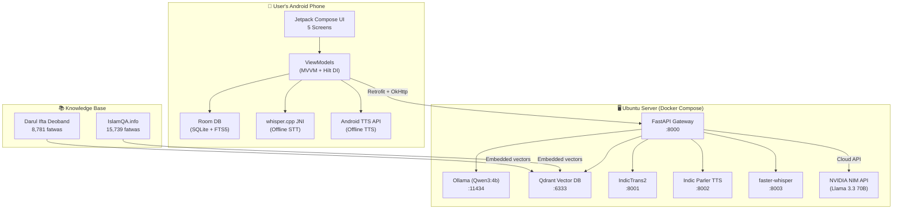
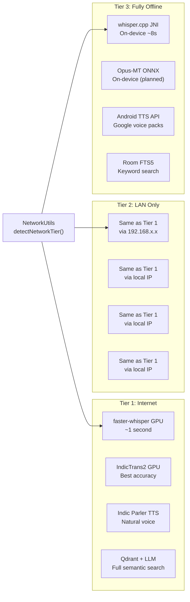
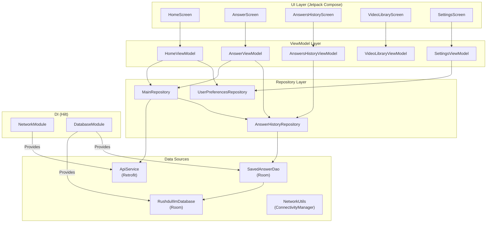
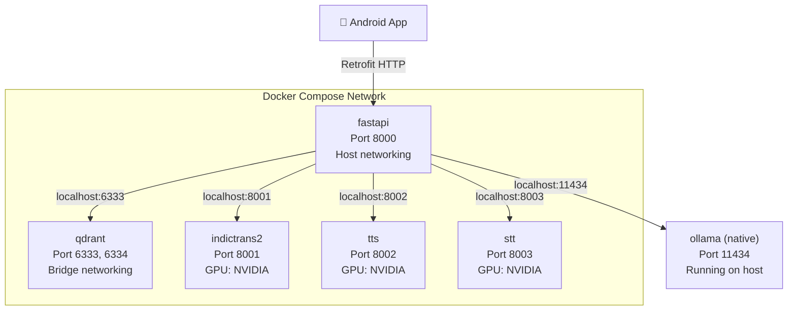
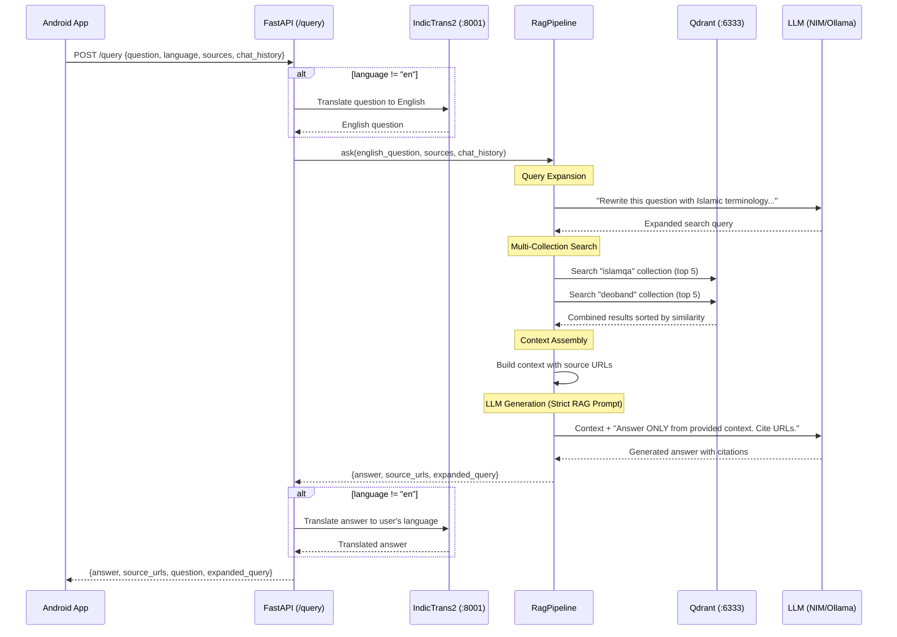
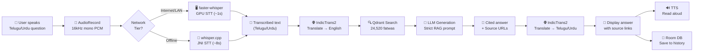
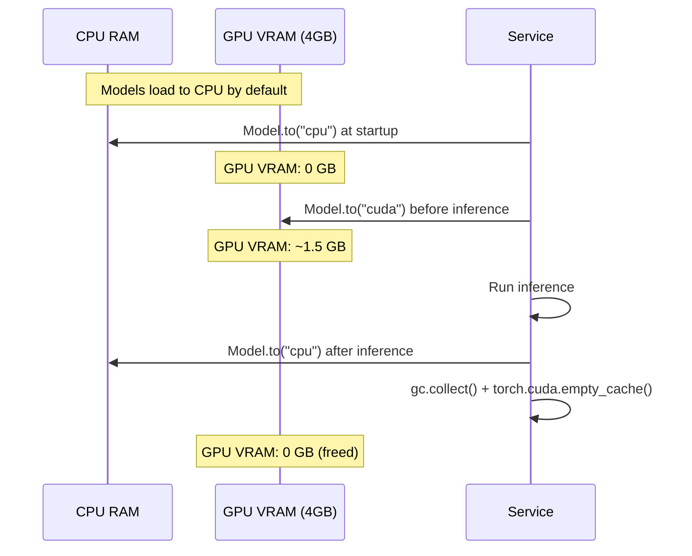

<
- [Six-Layer Architecture](#six-layer-architecture)
- [Three-Tier Offline Strategy](#three-tier-offline-strategy)
- [Android App Architecture (MVVM)](#android-app-architecture-mvvm)
- [Backend Services (Docker Compose)](#backend-services-docker-compose)
- [RAG Pipeline Flow](#rag-pipeline-flow)
- [End-to-End Data Flow](#end-to-end-data-flow)
- [Dynamic GPU Offloading](#dynamic-gpu-offloading)
- [Technology Decision Matrix](#technology-decision-matrix)
- [Network Tier Detection](#network-tier-detection)

---

## System Overview



---

## Six-Layer Architecture

### Layer 1 — Android App (User Interface)
- **Technology**: Kotlin 2.x + Jetpack Compose (no XML)
- **Architecture**: MVVM + StateFlow + Hilt Dependency Injection
- **5 Screens**: Home (mic), Answer, Answers History, Video Library, Settings
- **Key Design**: Voice-first, 40%+ screen mic button, 48dp+ touch targets, bilingual labels

### Layer 2 — AI/NLP Core
- **STT**: faster-whisper (GPU) or whisper.cpp (on-device)
- **Translation**: IndicTrans2 (GPU, 8-bit quantized) — Telugu/Urdu/Hindi ↔ English
- **TTS**: Indic Parler TTS (GPU) or Android TTS API (offline)
- **LLM**: NVIDIA NIM (Llama 3.3 70B primary) + Ollama Qwen3:4b (fallback)

### Layer 3 — Islamic Knowledge Sources
- Scraped and structured from authenticated Islamic scholar websites
- Stored in SQLite databases with metadata (title, question, answer, URL)
- Converted to vector embeddings for semantic search

### Layer 4 — RAG Pipeline
- **Framework**: LlamaIndex
- **Retrieval**: Multi-collection Qdrant semantic search
- **Generation**: Strict prompt — answers only from provided context with source citations
- **Enhancement**: Query expansion, conversational clarification, chat history

### Layer 5 — Islamic Video Database (Planned)
- YouTube Islamic lectures indexed with whisper transcripts
- Searchable by topic via Qdrant
- Offline playback via ExoPlayer

### Layer 6 — Self-Hosted Backend
- Docker Compose orchestration
- All services on a single Ubuntu machine with RTX 3050 GPU
- Portable to any Linux VPS with Docker support

---

## Three-Tier Offline Strategy



### How Network Detection Works
1. `ConnectivityManager.NetworkCallback` provides a reactive stream of connectivity changes
2. The app attempts to ping the local Ubuntu server (192.168.x.x:8000) with 200ms timeout
3. If the LAN server responds → **Tier 2 (LAN)**
4. If not, check `NET_CAPABILITY_INTERNET` → **Tier 1 (Internet)**
5. Otherwise → **Tier 3 (Offline)**

The app shows a visual banner:
- 🟢 No banner when online
- 🟠 `"📵 Offline Mode — Using Downloaded Knowledge"` when Tier 3 is active
- 🟢 Brief `"Back Online!"` notification when connectivity restores

---

## Android App Architecture (MVVM)



### Key Patterns
- **StateFlow**: All UI state is exposed via `StateFlow` from ViewModels
- **Sealed Classes**: `HomeUiState` uses sealed classes (Idle, Recording, Processing, NavigatingToAnswer, Error)
- **Repository Pattern**: ViewModels never directly access network or database
- **Hilt DI**: All dependencies injected at construction time
- **Resource wrapper**: Network calls return `Resource<T>` (Success, Error, Loading)

---

## Backend Services (Docker Compose)



### Service Details

| Service | Docker Image | Volumes | GPU | Notes |
|---------|-------------|---------|-----|-------|
| **fastapi** | Custom (python:3.11-slim) | `./:/app`, local_models, data folders | No | Host networking for Ollama access |
| **qdrant** | qdrant/qdrant:latest | qdrant_data (named) | No | Persistent vector storage |
| **indictrans2** | Custom (python:3.11) | venv_indictrans2, hf_models_data | NVIDIA | 8-bit quantized models |
| **tts** | Custom (python:3.11) | venv_tts, local_models | NVIDIA | Float16 model loading |
| **stt** | Custom (python:3.11) | venv_stt | NVIDIA | faster-whisper-large-v3-turbo |
| **ollama** | Native (not Docker) | ~/.ollama | NVIDIA | Runs on host, not in container |

---

## RAG Pipeline Flow



### RAG Safety Prompt (Simplified)
```
You are a helpful Islamic knowledge assistant.
Answer ONLY from the provided context below.
Do NOT use your own knowledge or training data.
Always cite the exact source URL at the end of your answer.
If the question is vague, ask a clarifying question.
If no relevant information is found, say:
"I could not find an answer in the approved Islamic sources.
 Please consult a qualified Islamic scholar."
```

---

## End-to-End Data Flow



---

## Dynamic GPU Offloading

The RTX 3050 (4GB VRAM) cannot run all GPU models simultaneously. The backend implements **dynamic GPU offloading**:



**Rule**: Only ONE GPU-heavy model runs at a time. Services are called sequentially (Translation → TTS → STT), never in parallel.

---

## Network Tier Detection

```kotlin
// Simplified NetworkUtils.kt logic
enum class NetworkTier { INTERNET, LAN, OFFLINE }

fun detectNetworkTier(context: Context): NetworkTier {
    val cm = context.getSystemService(ConnectivityManager::class.java)
    val network = cm.activeNetwork ?: return NetworkTier.OFFLINE
    val caps = cm.getNetworkCapabilities(network) ?: return NetworkTier.OFFLINE

    return if (pingServer("192.168.x.x", 8000, timeoutMs = 200)) {
        NetworkTier.LAN
    } else if (caps.hasCapability(NET_CAPABILITY_INTERNET)) {
        NetworkTier.INTERNET
    } else {
        NetworkTier.OFFLINE
    }
}
```

The app uses `ConnectivityManager.NetworkCallback` + `callbackFlow` for real-time reactive updates instead of polling.

---

## Technology Decision Matrix

| Decision | Chosen | Alternative Rejected | Why |
|----------|--------|---------------------|-----|
| Android UI | Jetpack Compose | XML layouts | Modern, declarative, Google's standard since 2021 |
| LLM | NVIDIA NIM + local Qwen3:4b | Cloud APIs (OpenAI, Anthropic) | Privacy + offline fallback |
| Vector DB | Qdrant (self-hosted) | Pinecone, Weaviate | Self-hosted, no data leaves infrastructure |
| RAG Framework | LlamaIndex | LangChain | Simpler API for our RAG use case |
| Translation | IndicTrans2 | Google Translate API | Privacy, self-hosted, best Indic language quality |
| TTS | Indic Parler TTS | Google TTS API | Self-hosted, natural Indian language voices |
| On-device STT | whisper.cpp (C++ JNI) | Google STT | Works fully offline, 99 languages |
| HTTP Client | Retrofit + OkHttp | Ktor, Volley | Most popular Android HTTP client, best documentation |
| DI Framework | Hilt | Dagger, Koin | Google recommended, works well with Compose |
| Local DB | Room + FTS5 | Firebase, Realm | Built-in Android, offline-first, full-text search |
| Backend Framework | FastAPI | Django, Flask | Fastest Python API, async, auto-generated docs |
| Orchestration | Docker Compose | Kubernetes, manual | Single command to start all services, portable |

---

> **Next**: See [DEVELOPMENT_STATUS.md](DEVELOPMENT_STATUS.md) for current build progress and known issues.
]]>
