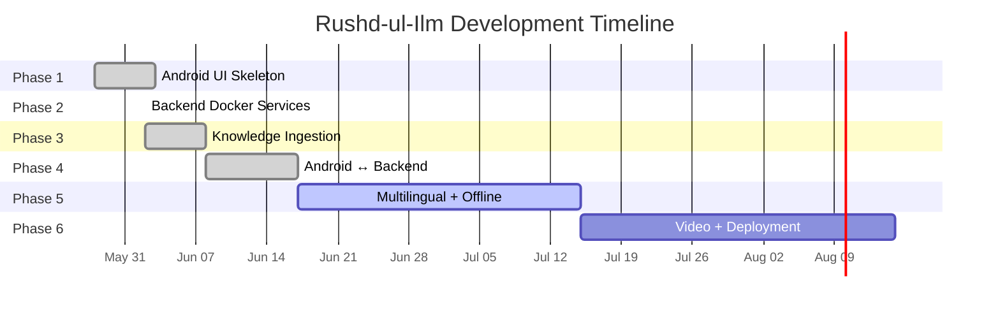

# 📊 Development Status — Rushd-ul-Ilm

> Last updated: June 29, 2026

---

## Current Status

| | |
|---|---|
| **Current Phase** | Phase 5 — Multilingual + Offline |
| **Overall Progress** | ~85% of core features implemented |
| **Active Sprint** | Sprint 5.3 — Offline STT Integration |
| **Next Major Milestone** | Phase 6 — Video Library + Production Deployment |

---

## Phase Progress

| Phase | Name | Status | Micro-tasks | Key Deliverable |
|:-----:|------|:------:|:-----------:|-----------------|
| 1 | Android UI Skeleton | ✅ Complete | 29/29 | 5 working screens with navigation, theming, accessibility |
| 2 | Backend Docker Services | ✅ Complete | 10/10 | FastAPI + Qdrant + Ollama containerized and tested |
| 3 | Knowledge Ingestion | ✅ Complete | 6/6 | 24,520 fatwas embedded in Qdrant with semantic search |
| 4 | Connect Android to Backend | ✅ Complete | 6/6 + fixes | Full Q&A pipeline, answer history, network detection |
| 5 | Multilingual + Offline | 🟡 ~90% | ~11/12 + fixes | Translation, TTS, STT working; offline translation pending |
| 6 | Video Library + Deployment | ⬜ Not Started | 0/? | Video indexing, production deployment |

---

## Phase 1 — Android UI Skeleton ✅

**Completed: June 3, 2026**

All 5 app screens built with Jetpack Compose, full bottom navigation, Material3 theming, bilingual labels, and accessibility compliance.

| Sprint | Name | Status |
|--------|------|--------|
| 1.1 | Environment & Project Setup | ✅ 7/7 tasks |
| 1.2 | App Structure & Navigation | ✅ 6/6 tasks |
| 1.3 | Home Screen | ✅ 6/8 tasks |
| 1.4 | Answer Screen | ✅ 3/7 tasks |
| 1.5 | Video Library Screen | ✅ 2/5 tasks |
| 1.6 | Settings Screen | ✅ 1/5 tasks |
| 1.7 | String Resources & Theming | ✅ 2/2 tasks |
| 1.8 | Phase 1 Integration Test | ✅ 2/2 tasks |

### Screens Built
- **HomeScreen** — Giant animated mic button, language selector, source filter chips, offline banner
- **AnswerScreen** — Answer text, source badges, clickable URLs, AI transparency card, pinned Read Aloud button
- **AnswersHistoryScreen** — Room DB-powered list of past answers with date/time
- **VideoLibraryScreen** — Video cards with search bar filtering
- **SettingsScreen** — Language, Madhab preference, offline download cards, accessibility toggles

---

## Phase 2 — Backend Docker Services ✅

**Completed: June 2, 2026**

All backend services containerized and verified with GPU acceleration.

| Sprint | Name | Status |
|--------|------|--------|
| 2.1 | Docker + NVIDIA Toolkit | ✅ 2/2 tasks |
| 2.2 | docker-compose.yml | ✅ 1/1 tasks |
| 2.3 | Ollama + Qwen3:4b | ✅ 1/1 tasks |
| 2.4 | FastAPI Server Skeleton | ✅ 2/2 tasks |
| 2.5 | Qdrant Vector DB | ✅ 1/1 tasks |
| 2.6 | Wire FastAPI to Ollama | ✅ 1/1 tasks |
| 2.7 | Integration Test | ✅ 2/2 tasks |

### Services Running
- **FastAPI** (port 8000) — Main API gateway with `/query`, `/health` endpoints
- **Qdrant** (port 6333) — Vector database with 2 collections
- **Ollama** (native, port 11434) — Qwen3:4b local LLM

---

## Phase 3 — Knowledge Ingestion ✅

**Completed: June 8, 2026**

All Islamic knowledge sources scraped, processed, and embedded into vector collections.

| Sprint | Name | Status |
|--------|------|--------|
| 3.1 | Scraper Review & Test | ✅ 6/6 tasks |

### Knowledge Base Stats
| Collection | Source | Fatwas | Embedding Model | Dimensions |
|-----------|--------|--------|-----------------|-----------|
| `islamqa` | islamqa.info | 15,739 | paraphrase-multilingual-MiniLM-L12-v2 | 384 |
| `deoband` | darulifta-deoband.com | 8,781 | paraphrase-multilingual-MiniLM-L12-v2 | 384 |
| **Total** | | **24,520** | | |

### RAG Pipeline Features
- ✅ Multi-collection semantic search (searches both sources simultaneously)
- ✅ Query expansion (LLM rewrites questions with Islamic terminology)
- ✅ Conversational clarification (asks follow-up questions for vague queries)
- ✅ Multi-turn chat history support
- ✅ Source filtering (user can select Hanafi / Neutral / All)
- ✅ NVIDIA NIM API (Llama 3.3 70B) as primary LLM with local Qwen3:4b fallback

---

## Phase 4 — Connect Android to Backend ✅

**Completed: June 17, 2026**

Android app fully connected to backend with live Q&A, answer history, and network detection.

| Sprint | Name | Status |
|--------|------|--------|
| 4.1 | Network Layer & Repository | ✅ 2/2 tasks |
| 4.2 | Wire Home Screen to Backend | ✅ 1/1 tasks + bug fixes |
| 4.3 | Display Real Answer | ✅ 1/1 tasks + enhancements |
| 4.4 | Network Tier Detection | ✅ 1/1 tasks |
| 4.5 | Phase 4 Integration Test | ✅ 1/1 tasks |

### Features Delivered
- ✅ Retrofit + OkHttp network layer
- ✅ Hilt-injected repository pattern
- ✅ Real-time network tier detection (Internet/LAN/Offline)
- ✅ Offline banner with automatic "Back Online" notification
- ✅ Multiple source display with named badges
- ✅ AI transparency card showing expanded search query
- ✅ Global Madhab preference filtering
- ✅ Dynamic language switching (Telugu, Urdu, Hindi, English)
- ✅ Room database for answer history with auto-save
- ✅ Answer history screen with navigable saved answers
- ✅ CLEARTEXT HTTP fix for emulator development
- ✅ Null-safety hardening for server responses

---

## Phase 5 — Multilingual + Offline 🟡

**In Progress: June 17 — present**

Translation, TTS, and STT services implemented with dynamic GPU offloading.

| Sprint | Name | Status |
|--------|------|--------|
| 5.1 | IndicTrans2 Translation | ✅ 4/4 tasks + bug fixes |
| 5.2 | TTS Service | ✅ 3/3 tasks |
| 5.3 | STT Service | ✅ 4/4 tasks |
| 5.4 | Offline Fallbacks | 🟡 Partially done |

### What's Working
- ✅ IndicTrans2 translation (English ↔ Telugu/Urdu/Hindi) with 8-bit quantization (~1.5GB VRAM)
- ✅ End-to-end Telugu/Hindi Q&A pipeline (ask in Telugu → get Telugu answer with citations)
- ✅ Indic Parler TTS generating speech in Indian languages
- ✅ faster-whisper GPU STT for online speech recognition
- ✅ Dynamic GPU offloading (models move CPU ↔ GPU to share 4GB VRAM)
- ✅ Android app plays TTS audio via MediaPlayer
- ✅ Offline TTS fallback using Android TextToSpeech API
- ✅ whisper.cpp JNI bridge for offline STT (C++ compiled, Kotlin JNI interface ready)
- ✅ Audio capture (16kHz mono PCM) via AudioRecorderHelper
- ✅ Virtual environment isolation (separate venvs for translation, TTS, STT to avoid dependency conflicts)
- ✅ Lazy model loading to reduce idle RAM usage
- ✅ STT CUDA library configuration resolved

### What's Pending
- ⬜ Opus-MT ONNX for fully offline on-device translation
- ⬜ Actual whisper.cpp model weights bundled with APK (currently placeholder)
- ⬜ End-to-end offline STT → offline search → offline answer pipeline testing

### Bug Fixes Applied in Phase 5
| Bug | Root Cause | Fix |
|-----|-----------|-----|
| Hindi text repetition loop | `transformers 5.x` incompatible with IndicTrans2 cache | Pinned `transformers==4.45.2` in isolated venv |
| CUDA OOM on translation | `num_beams=5` caused KV cache VRAM spikes | Reduced to `num_beams=2` |
| FastAPI + translation dependency conflict | Shared venv had incompatible transformers versions | Separate virtual environments per service |
| NVIDIA NIM timeout | `gpt-oss-20b` model took >60s | Switched to `meta/llama-3.3-70b-instruct` |
| Float16 audio incompatibility | scipy can't write Float16 WAV | Convert to Float32 before disk write |
| STT missing CUDA libs | `nvidia-cublas-cu12` not installed in venv | Installed CUDA libraries, set LD_LIBRARY_PATH |

---

## Phase 6 — Video Library + Deployment ⬜

**Not Started**

| Planned Feature | Description |
|----------------|-------------|
| Video scraping | Download YouTube Islamic lecture metadata using yt-dlp |
| Video transcription | Batch transcribe lectures with faster-whisper |
| Video indexing | Embed transcripts into Qdrant for semantic search |
| Video playback | ExoPlayer integration for streaming + offline |
| Production deployment | Docker Compose on Linux VPS |
| App distribution | Google Play Store listing |

---

## Known Issues

| # | Issue | Severity | Status | Details |
|---|-------|----------|--------|---------|
| 1 | VRAM constraint (4GB) | Medium | ✅ Mitigated | Dynamic GPU offloading implemented; services run sequentially |
| 2 | UserPreferencesRepository in-memory | Low | 🟡 Open | Settings don't persist across app restarts; needs DataStore migration |
| 3 | whisper.cpp model not bundled | Medium | 🟡 By Design | 182MB model must be downloaded separately for release builds |
| 4 | Docker containers use ~2-3GB RAM | Low | ✅ Mitigated | Lazy loading lifespan pattern reduces idle RAM |
| 5 | Emulator ADB connection unstable | Low | 🟡 Open | Headless emulator drops ADB after deployment |
| 6 | Specific JAVA_HOME required | Low | 🟡 Open | Must point to Android Studio bundled JBR (Java 21) |
| 7 | Offline translation not yet available | Medium | 🟡 Planned | Opus-MT ONNX implementation deferred to Phase 6 |
| 8 | IndicTrans2 Urdu translation quality | Low | 🟡 Open | Urdu translation less accurate than Telugu; may need fine-tuning |

---

## Development Timeline

---

## Agent Contributions

This project uses multiple AI coding agents. Here is a summary of their contributions:

| Agent | Sessions | Primary Contributions |
|-------|----------|----------------------|
| Gemini CLI | ~25 | UI screens, theming, backend setup, RAG pipeline, ingestion |
| Codex (GPT-5) | ~5 | Environment setup, emulator, Mem0 helper |
| Antigravity (Gemini) | ~10 | Code commenting, TTS/STT integration, GPU offloading, history feature |

---

> **Navigation**: [← Architecture](ARCHITECTURE.md) | [↑ README](../README.md) | [→ Contributing](../CONTRIBUTING.md)

